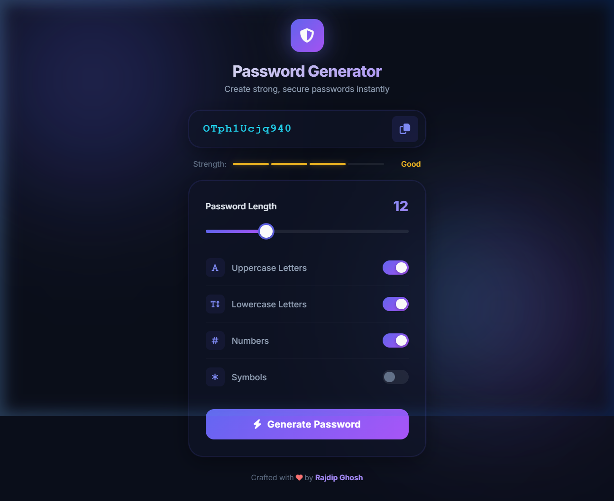

<p align="center">
  
</p>

<h1 align="center">🔐 Password Generator</h1>

<p align="center">
  A sleek, modern password generator with a premium glassmorphism UI.<br/>
  Generate strong, secure passwords with full customization — instantly.
</p>

<p align="center">
  
  
  
  
</p>

---

## ✨ Features

| Feature | Description |
|---------|-------------|
| 🎨 **Premium Dark UI** | Glassmorphism design with animated gradient background orbs |
| 🔒 **Secure Generation** | Full A–Z alphabet with uppercase, lowercase, numbers & symbols |
| 📊 **Strength Indicator** | Real-time 4-level password strength visualization (Weak → Strong) |
| 📋 **One-Click Copy** | Copy password to clipboard with animated tooltip feedback |
| 🎚️ **Adjustable Length** | Smooth slider from 4 to 32 characters |
| 🔘 **Modern Toggles** | Beautiful toggle switches for each character type |
| 📱 **Fully Responsive** | Looks great on desktop, tablet & mobile |
| ⚡ **Micro-Animations** | Smooth hover effects, button ripples & entrance animations |

---

## 🚀 Getting Started

### Option 1 — Open Directly
```
Just open index.html in any modern browser.
```

### Option 2 — Local Server
```bash
# Using npx (no install needed)
npx http-server -p 8080

# Then visit
http://localhost:8080
```

---

## 🛠️ Tech Stack

- **HTML5** — Semantic structure with SEO best practices
- **CSS3** — Custom Properties, Glassmorphism, Backdrop Blur, Keyframe Animations
- **JavaScript** — Vanilla ES6+ with Clipboard API
- **Google Fonts** — [Inter](https://fonts.google.com/specimen/Inter) for premium typography
- **Font Awesome 6** — Icon library

---

## 📁 Project Structure

```
Password-Generator-main/
├── index.html      # Main HTML with semantic structure
├── style.css       # Premium glassmorphism styles & animations
├── script.js       # Password generation logic & UI interactions
├── preview.png     # App screenshot
└── README.md       # This file
```

---

## 🎯 How It Works

1. **Adjust the length** using the slider (4–32 characters)
2. **Toggle options** — uppercase, lowercase, numbers, symbols
3. **Click Generate** — a secure password is created instantly
4. **Check strength** — the indicator shows Weak / Fair / Good / Strong
5. **Copy** — one click copies the password to your clipboard

> 💡 The generator guarantees at least one character from each selected category and shuffles the result for maximum security.

---

## 🤝 Contributing

Contributions, issues, and feature requests are welcome!

1. Fork the repository
2. Create your feature branch (`git checkout -b feature/amazing-feature`)
3. Commit your changes (`git commit -m 'Add amazing feature'`)
4. Push to the branch (`git push origin feature/amazing-feature`)
5. Open a Pull Request

---

## 📄 License

This project is free to use for personal and commercial purposes.

---

<p align="center">
  Crafted with ❤️ by <strong>Rajdip Ghosh</strong>
</p>